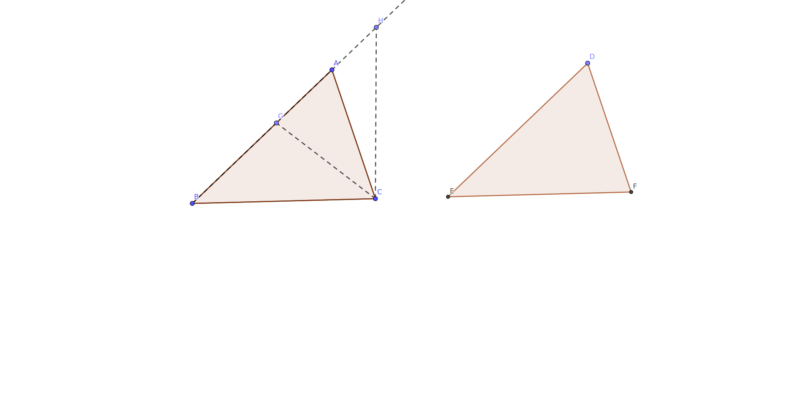

---
title: "数学"
author: "zhang"
date: "`r Sys.Date()`"
output: 
  bookdown::tufte_html_book:
    toc: yes 
    css: toc.css
bibliography: [book.bib, packages.bib]
biblio-style: apalike
link-citations: yes
description: "This is a minimal example of using the bookdown package to write a book. The output format for this example is bookdown::gitbook"
---

# Preface{-}

数学的学习，我认为最重要的不是＂学＂，而是说服你自己，我到底可以相信这些定理吗？在多大程度上，他们是成立的？当你写下数学符号的时候，需要注意你引用这些定理的前提条件．盲目的使用定理会让你失去学习数学最重要的灵魂－－－逻辑．

如果每一个问题，都去追寻到源泉，这是不现实的．首先，我们也许暂时没法理解，所以我们需要把和这个问题相关的定理暂时放在一边，再次，如果每次证明都要寻根索源，那证明将显得非常臃肿，反而把要证明的问题冲淡了．所以，我在开篇这里，首先把文中需要的用到的定理在这里先证明，以便于后面直接引用，这和欧几里得几何的方式是一样的．

## 欧几里得几何的演绎基础．

这里所谓的＂基础＂，是指无需证明，你只能接受的前提．这些前提的改变，会改变整个定理的面貌．这个基础，包含了定义，公设，公理．

定义，公理，公设，从某种方面来看，都是一样的，他们都是假设，但你要接受这些为真．我想强调一点，_以后在使用欧几里得定理的时候，我们默认了这些定义，公理，公设_ ，如果以后我们碰到的问题是和这些前提矛盾的，我们将使用新的假设，那么有些欧几里得的定理就可能不适用了．

定义

	1. 点
	2. 直线
	3. 线段
	4. 平面
	5. 圆

欧几里得平面几何的五条公理（公设）是：

    1. 从一点向另一点可以引一条直线。
    2. 任意线段能无限延伸成一条直线。
    3. 给定任意线段，可以以其一个端点作为圆心，该线段作为半径作一个圆。
    4. 所有直角都相等。
    5. 若两条直线都与第三条直线相交，并且在同一边的内角之和小于两个直角，则这两条直线在这一边必定相交。

欧几里得还提出了五个一般概念，也可以作为公理。

    1. 与同一事物相等的事物相等。
    2. 相等的事物加上相等的事物仍然相等。
    3. 相等的事物减去相等的事物仍然相等。
    4. 一个事物与另一事物重合，则它们相等。
    5. 整体大于局部。


## 定理


所谓定理，就是依据上面这些假设，推理出来的命题．我们可以用上面的假设，来推理一个命题为真或者为假．

平行线的性质

严格的说，这一条不算定理，因为它其实就是公设里面第５条的等价形式．如下图所示：


```{r label = parallel, fig.fullwidth = T, fig.cap = "平行线"}
knitr::include_graphics("images/parallel.png")

```

符号说明，$\pi$表示两个直角的和．

根据公设5

$\angle\alpha$ + $\angle\beta$ < $\pi$，那么：

直线AC和直线AB相交

若$\angle\varepsilon$ + $\angle\gamma$ = $\pi$, 那么：

直线AB和直线FG不相交

因为如果直线AB和直线FG相交

那么根据公设5：

$\angle\varepsilon$ + $\angle\gamma$ < $\pi$ 也成立．

根据前提，$\angle\varepsilon$ + $\angle\gamma$ = $\pi$也成立．

根据公理5，整体大于局部．

两个角度的和要么小于$\pi$，要么等于$\pi$，只能是其中之一．否则，整体将等于局部．

所以，假设AB和FG相交不成立．AB和FG必平行．

这里有一个很有趣的问题，我们看看以下的证明有什么问题．

若$\angle\varepsilon$ + $\angle\gamma$ = $\pi$, 那么：

直线AB和直线FG不相交

因为如果直线AB和直线FG相交

那么根据公设5：

$\angle\varepsilon$ + $\angle\gamma$ < $\pi$．

这和$\angle\varepsilon$ + $\angle\gamma$ = $\pi$相矛盾．

所以，AB和FG必平行

这里的问题是，注意看公设5，它只是说了角度小于$\pi$会导致相交，并没有说，相交会导致角度和小于$\pi$，因此，_根据公设5： $\angle\varepsilon$ + $\angle\gamma$ < $\pi$．_　这个是错误的．

顺便推出对顶角相等，同位角相等．

根据直角和的定义：

$\varepsilon + \zeta = \pi$

$\delta + \zeta = \pi$

根据等量减等量依然相等

$\varepsilon = \pi - \zeta$

$\delta = \pi - \zeta$

所以

$\varepsilon = \delta$

依据平行线的性质：

$\varepsilon + \gamma = \pi$

依据直角和的定义：

$\gamma + \beta = \pi$

同样的方式可得：

$\varepsilon = \beta$

$\beta$和$\eta$是对顶角

$\beta$ = $\eta$

$\varepsilon$ = $\eta$


```{theorem, label = icsosceles, name = "等腰三角形"}

如果一个三角形的两条边相等，那么他们对应的角也相等

```

```{r}
knitr::include_url("images/isosceles_triangle.html")
```

已知：$\Delta$AEB, AE = BE

求证：$\angle$ A = $\angle$ B

```{proof}
翻转$\Delta$AEB,
形成一个新的三角形，让这个新的三角形的E点和原来的三角形E点重合，因为AE = BE, 我们可以让B点和A点重合，因为两个三角形的$\angle$E相等，新三角形的A点会和原来的三角形的B点重合，三角形的三个顶点重合，那么这两个三角形完全重合，根据公理4, 他们相等．因此，$\angle$A = $\angle$B

```

```{theorem, label = bigangle, name = "大边对大角"}
三角形大边对大角

```

已知：BC > BA

求证：$\angle$ BAC > $\angle$ C

```{r label = bsangle, fig.cap = "角边关系", fig.fullwidth = T}


```

```{marginfigure}
证明外角大于内角
```

```{proof}
如图： 在BC上截取一点D，使得BD = BA

根据定理\@ref(thm:icsosceles),

$\angle$BAD = $\angle$BDA

根据外角大于内角(有待证明在前面)

$\angle$BDA > $\angle$C

根据公理５

$\angle$BAC > $\angle$BDA

因此

$\angle$BAC > $\angle$C

```


```{lemma, label = angleside, name = "大角对大边"}
在一个三角形中，如果一个角大于另一个角，那么大角对应的边也大于小角对应的边

```

以知： $\angle$BAC > $\angle$C

求证：BC > BA


```{marginfigure}

想把建立图片的联系，发现一定要给图片命名，只是给标签不行．

```


```{proof}

如上图 \@ref(fig:bsangle)

$\angle$BAC > $\angle$C

若BC $\leq$ BA

BC < BA 则：

根据定理 \@ref(thm:bigangle)

$\angle$BAC < $\angle$C

若 BD = BA

根据定理 \@ref(thm:icsosceles) 

$\angle$BAC = $\angle$C

因此，若 BC $\leq$ BA，那么：

$\angle$BAC $\leq$ $\angle$C

这和$\angle$BAC > $\angle$C 相矛盾

故必有：

BC > BA

```

这个证明用了反证法，以条件为真，得出结果和前提矛盾，因为这是一一对应的关系．不是一一对应关系，那该证明可能很复杂．比如

```{theorem, label = SAS, name = "SAS定理"}
若两个三角形的两条边相等，他们对应的夹角也相等，那么这两个三角形全等．

```

如图：

```{r}
knitr::include_graphics("images/SAS.png")
```

```{proof}
如上图：

给定$\Delta$ABC的两条边, AB和BC，还有一个夹角$\alpha$，只能作出一个三角形．

那么，给定同要的条件，我们在其他地方画的三角形不过是这个三角形的复制品.

证毕

你可以想象，在给定的条件下，同时画两个三角形，你把这两个三角形的对应边和角
重合起来．比如$\Delta$ABC和$\Delta$$A{\prime}B{\prime}C{\prime}$，AB和$A{\prime}B{\prime}$重合，
因为$\alpha$ = $\alpha$，BC和$B{\prime}C{\prime}$也可以重合，两个三角形完全重合

故：$\Delta$ABC$\cong$$\Delta$$A{\prime}B{\prime}C{\prime}$

```


```{theorem, label =SSS, name = "SSS定理"}
如果两个三角形的三条边相等，那么这两个三角形全等．

```

```{r}
knitr::include_url("images/SSS.html")
```

```{proof}
如图：给定三角形的三条边，只能作出两个三角形，由于圆的对称性，如果把下面的半圆以两个圆的圆心的连线为准线，向上翻转，那么两个圆各自和各自的上半圆重合，因此他们的交点也重合，故，两个三角形重合．因此，给定三角形的三边，只能作出一个三角形，因此，三边相等的三角形必重合．

也可以用SAS定理来证明SSS定理

如上图

可以用等腰三角形的性质得到两条边的夹角相等，加上条件，两条边是相等的

根据SAS定理

两个三角形全等．

```

```{theorem, label = ASA, name = "ASA定理"}
如果两个三角形的两个角相等，他们所夹的边也想等，那么这两个三角形全等．

```

```{r}

```


如图所示：$\Delta$ABC 和　$\Delta$DEF

以知：$\angle$B = $\angle$E

$\angle$ACB = $\angle$F

BC = EF

求证：$\Delta$ABC$\cong$\Delta$DEF


```{proof}


```


```{r include=FALSE}
# automatically create a bib database for R packages
knitr::write_bib(c(
		   .packages(), "bookdown", "knitr", "rmarkdown"
		   ), "packages.bib")
```


